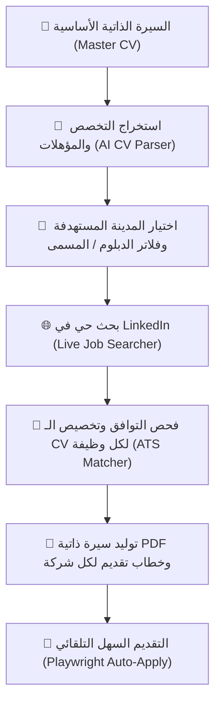

# 💼 AutoJob-AI: LinkedIn Job Finder, AI ATS CV Tailor & Auto-Apply Bot
### مساعد التوظيف الذكي: للبحث الدقيق وتخصيص السير الذاتية (ATS) والتقديم التلقائي في LinkedIn

<p align="center">
  
  
  
  
  
</p>

---

## 📖 نظرة عامة (Overview)

**AutoJob-AI** هي أداة ذكية متكاملة مصممة لأتمتة رحلة البحث عن عمل:
1. **قراءة وتحليل السيرة الذاتية الأساسية (Master CV):** ترفع سيرتك (PDF أو Word)، ويقوم الذكاء الاصطناعي باستخراج تخصصك ومؤهلاتك ومهاراتك الحقيقية واقتراح أفضل المسميات الوظيفية الصريحة.
2. **البحث الحي في LinkedIn:** تختار المدينة المستهدفة (الرياض، ينبع، الجبيل، جدة، Remote، أو أي مدينة)، وتقوم الأداة ببحث حي مع فلاتر صارمة لمنع الوظائف العشوائية أو وظائف المدراء غير المناسبة.
3. **فحص ومطابقة المؤهل والخبرة:** فحص الوصف الوظيفي للتأكد من ملاءمته للدبلوم أو البكالوريوس مع شارات توضيحية لسنوات الخبرة ونوع الدور (فني / تقني / مهندس).
4. **تخصيص السيرة الذاتية (ATS Tailoring) وتوليد PDF:** مقارنة متطلبات الوظيفة مع ملفك وإعادة صياغة الملخص والمهارات لتمر بنجاح من أنظمة الفرز الآلي (ATS) بصيغة PDF فوري ونظيف، وكتابة خطاب تقديم مخصص (Cover Letter).
5. **التقديم الآلي (Playwright Auto-Apply):** تشغيل متصفح مؤتمت يفتح نموذج التقديم السهل (Easy Apply) ويرفع سيرتك الذاتية المخصصة لتلك الشركة مع حفظ جلسة الدخول بشكل آمن محلياً.

---

## 🏗️ آلية العمل (Workflow)



---

## ⚡ المميزات الرئيسية (Key Features)

- ✅ **استخراج ذكي للتخصص والشهادة:** لا حاجة لكتابة بياناتك يدوياً؛ الأداة تفهم مجالك الأكاديمي والمهني من ملفك.
- ✅ **فلاتر بحث صارمة وذكية:** استبعاد الوظائف الإدارية (`Manager / Director / Lead`) وتصفية وظائف الفنيين والتقنيين أو المهندسين بدقة.
- ✅ **فاحص الدبلوم والشهادات:** يحدد تلقائياً هل الوظيفة تقبل دبلوم المعاهد والكليات التقنية أم تشترط بكالوريوس فقط.
- ✅ **سير ذاتية متوافقة 100% مع أنظمة ATS:** توليد ملفات PDF بنصوص واضحة وخطوط TrueType دون أي تشويه في الرموز أو الحروف.
- ✅ **حماية الخصوصية 100%:** جميع ملفاتك، جلسات تسجيل الدخول، ومفاتيح الـ API تظل محفوظة محلياً على جهازك ولا تُشارك في أي سحابة خارجية.

---

## 🚀 التثبيت والتشغيل (Quick Start)

### 1. استنساخ المشروع (Clone the Repository)
```bash
git clone https://github.com/YOUR_USERNAME/linkedin-tool.git
cd linkedin-tool
```

### 2. تثبيت الحزم المطلوبة (Install Dependencies)
```bash
pip install -r requirements.txt
playwright install chromium
```

### 3. تشغيل الأداة (Run the Application)
- **على نظام Windows:** اضغط نقراً مزدوجاً على ملف `run.bat` مباشرة.
- **أو عبر موجه الأوامر (Terminal):**
```bash
streamlit run app.py
```

بعد التشغيل، ستفتح الأداة تلقائياً في متصفحك على:
👉 `http://localhost:8501`

---

## ⚙️ إعدادات الذكاء الاصطناعي (AI Configuration)

تدعم الأداة:
- **Google Gemini API** (موصى به - متوفر مجاناً وسريع جداً): احصل على مفتاحك من [Google AI Studio](https://aistudio.google.com/app/apikey).
- **OpenAI API** (`gpt-4o-mini`).
- يمكنك إدخال المفتاح مباشرة في الشريط الجانبي داخل الأداة وسيتم حفظه محلياً في ملف `data/settings.json` (محمي ومستبعد من Git).

---

## 📂 هيكلية المشروع (Project Structure)

```text
├── app.py                  # واجهة المستخدم التفاعلية (Streamlit Web UI)
├── config.py               # إدارة الإعدادات والمسارات والملفات
├── ai_engine.py            # محرك الذكاء الاصطناعي (Gemini / OpenAI)
├── cv_parser.py            # محلل السير الذاتية واستخراج التخصص والمهارات
├── job_searcher.py         # سكرابر وباحث LinkedIn مع فلاتر المسمى والمؤهل
├── cv_tailor.py            # محرك تخصيص السيرة الذاتية وتوليد الـ PDF الاحترافي
├── auto_apply.py           # مدير الأتمتة والتقديم في العمليات المستقلة
├── auto_apply_worker.py    # مشغل المتصفح المستقل بنظام Windows Proactor
├── run.bat                 # ملف تشغيل سريع بنقرة واحدة لـ Windows
├── requirements.txt        # الحزم والمكتبات المطلوبة للمشروع
├── .gitignore              # حماية الملفات السرية وجلسات المتصفح من الرفع
└── LICENSE                 # رخصة المشروع (MIT)
```

---

## 🔒 الأمان والخصوصية (Privacy & Security)

- ملفات السير الذاتية ومخرجات الـ PDF الشخصية مستبعدة تلقائياً في `.gitignore`.
- ملفات الجلسات وملفات تعريف الارتباط الخاصة بلينكدين (`data/browser_profile/`) لا يتم رفعها إطلاقاً.
- مفاتيح الـ API مخزنة في بيئتك المحلية فقط.

---

## 📄 الترخيص (License)
هذا المشروع مرخص تحت رخصة **MIT** - راجع ملف [LICENSE](LICENSE) لمزيد من التفاصيل.
